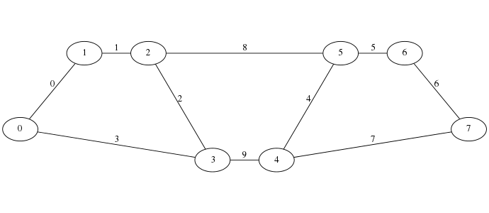

This is a proof of concept implementation of CircuitCocircuit algorithm for finding all small k-way bonds in a graph. The algorithm was devised by prof. Petr Hliněný.

Installation
------------

* Install OGDF Snapshot 2014-03-07 into `~/.bin/ogdf` (or elsewhere but edit Makefile)
* Run `make`

Input/output file specification
-------------------------------

**Input** Each line contains one edge described in format `<edge id>;<source node id>;<target node id>`

**Output** Each line contains one cut: edge indicies joined by comma (e.g. `1,2,3`)

Run
---

In `bin/`:

**mincuts**

	Usage:	mincuts <edge_file.csv> <cut size bound> <# of components> [-bfc]

		<# of components> can be exact or range (e.g. 2-3)
		-bfc --	use bruteforcing of all combinations instead of
			CircuitCocircuit algorithm

**cutcheck**

	Usage:	cutcheck <edge_file.csv> [-imc, --ismincut <list>] [-cc <list>]
			[-rcc <cuts file>] [-tcc[f] <cuts file>]

			-imc    -- verifies if <list> is cut and minimal one
			-cc     -- computes # of components of G\<list>
			-rcc    -- randomized cuts check
			-tcc[f] -- total cuts check, 'f' counts all failures

	*list* is comma separated list of edge indicies.

**cutdiff**

	Usage: cutdiff <file A with cuts> [<file B with cuts> | ~]
	Output:
		* Set difference A\B (note that B\A is not computed)
		* Each cut of A and B is considered a set
		* '~' replaces second file with empty set

**tester**

	This program tests CircuitCocircuit implementation.
	Usage:	tester	<cut size bound> <# of components> [-c, --canonical]
			[-r, --randomized <# of nodes> <min>-<max edges>]

		First two arguments are used for any graph being tested.
		<# of components> can be exact or range (e.g. 2-3)
		-r generate random graphs
		<max edges> is not strict (if the random graph is disconnected
			then we add edges to connect it)
		-c generates graphs cannonically using nauty

To allow for option `-c` you have to install [nauty](http://pallini.di.uniroma1.it/) (which is not redistributed with this program to avoid unnecessary licensing problems) and specify its location at the top of `Makefile`.

-----------

In `tools/`:

**csv2dot.sh**

Reads csv file with graph (path to file given in first argument) and prints it in the dot format (used by GraphViz).

**test_on_graph.sh**

Tests CircuitCocircuit implementation output against cuts computed by algorithm bruteforcing all combinations of edges.

**names2ids.py**

Converts from [ClosureSim](http://www.fi.muni.cz/~xsvobo38/closuresim/) output format to `mincuts` format.

	./tools/names2ids.py data/zlin-silnice.csv < temp/closuresim/results-2.csv > ires-2

**size_split**

Splits `mincuts` results file by cut size.

Data
----

**Graph 5**

`Graph 5` is good to understand how the algorithm works. It can be found in `sample-data/graph5.csv`.

**Zlín Region**

Road network of the [Zlín Region](http://en.wikipedia.org/wiki/Zl%C3%ADn_Region) can be found in `sample-data/zlin.csv`

**Getting new data from OpenStreetMap**

You can export data from [OpenStreetMap](https://www.openstreetmap.org/) and process them with [osm4routing](https://github.com/Tristramg/osm4routing) to get `csv` file.

You will probably want to select just data relevant to you. For example extract just certain roads:

	$ awk -F',' 'NR > 1 {if ($5 > "1") { print $1";"$2";"$3 }}' edges_raw.csv

This excludes edges which have 0 or 1 in the fifth column and thus are forbidden for cars or they are residential streets. See osm4routing page for detailed information.
